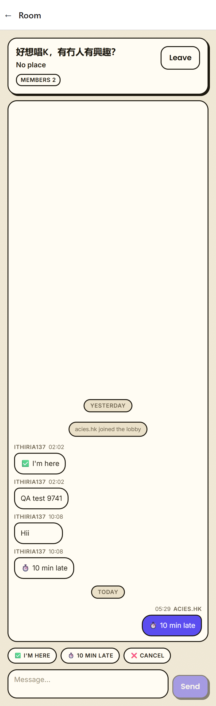
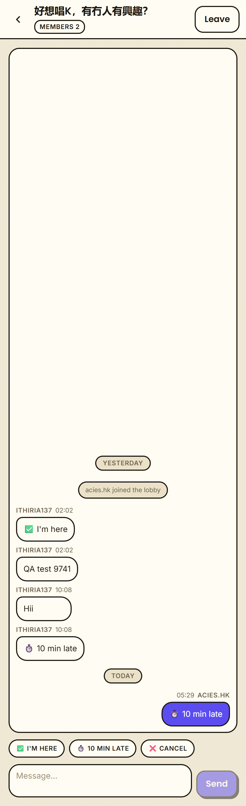
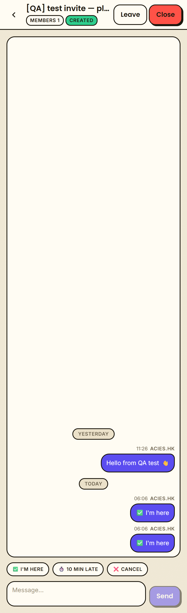
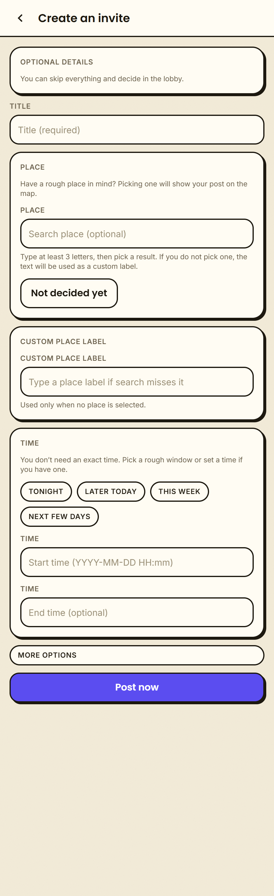
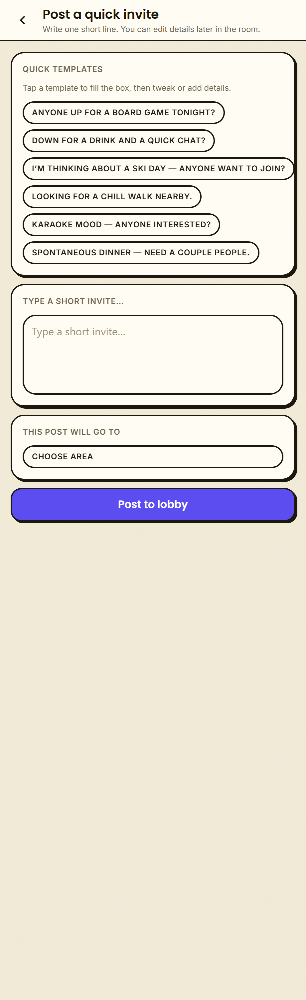

# Top App Bar — Before / After

Every non-tab screen used the **plain react-navigation native header** (an un-styled white bar with just "← Room" / "← Create"). It's now replaced by a soft-brutalist **`BAppBar`**: paper surface + a 2px bottom ink border (mirrors the bottom tab bar), safe-area inset, content capped to `maxContentWidth`. Page info moves _into_ the bar.

Component: `BAppBar` in `src/ui/components/brutal.tsx` (documented at `/uidocs` → **App Bar**). Native headers are turned off in `app/_layout.tsx` (`Stack screenOptions={{ headerShown: false }}`).

---

## 1. Room — the flagship

| Before                                               | After (member)                                      |
| ---------------------------------------------------- | --------------------------------------------------- |
|  |  |

- Plain white **"← Room"** bar (redundant label) **+ a separate header card** below holding title / place / members / Leave → **all merged into the app bar**; the card is gone, so the chat starts right under the bar.
- **Title + a single meta row** (`place · members · status`) instead of three stacked lines.
- **"No place" removed** — location shows only when the activity actually has one.

**Creator view** (owner sees Leave **and** Close): the two actions sit **side by side**, not stacked, so the bar stays short.

---

## 2. Create

| Before                                                 | After                                                 |
| ------------------------------------------------------ | ----------------------------------------------------- |
|  |  |

- Plain **"← Create"** native bar + a duplicate in-content "Create an invite" heading → **one styled bar** carrying the back button + title.

---

## 3. Compose (Post a quick invite)

- The back button (lost when the native header was removed) is **restored**, and the **title + subheader moved into the bar**.

---

## What moved where

| Screen                                                | Into the app bar                                                                              |
| ----------------------------------------------------- | --------------------------------------------------------------------------------------------- |
| **Room**                                              | back · title · (location ·) members · status · Leave/Close                                    |
| **Create**                                            | back · "Create an invite"                                                                     |
| **Edit**                                              | back · "Edit — <title>"                                                                       |
| **Compose**                                           | back · "Post a quick invite" + subheader                                                      |
| **Login / Register**                                  | _unchanged_ — centered auth screens stay headerless (Register keeps its "back to login" link) |
| **Feed / Lobby / Created / Notifications / Settings** | already had custom in-content headers; a fast-follow will unify them onto `BAppBar`           |

_Also nudged in: `BIconButton` hit area 40→44px and an `accessibilityLabel` (toward the 48dp touch-target / screen-reader guidance in the M3 adoption guide)._
