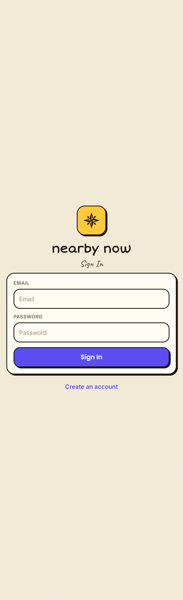
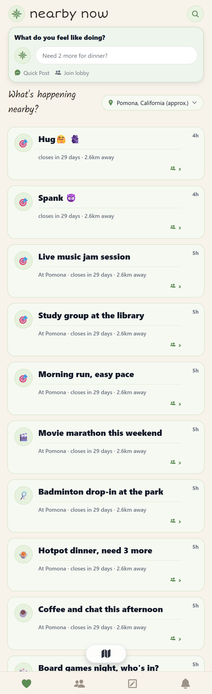
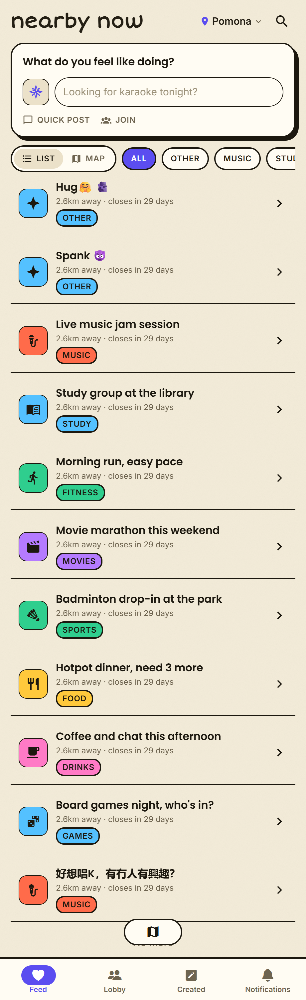
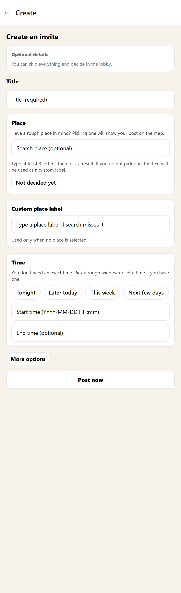
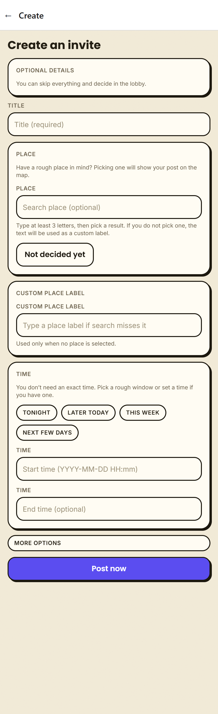
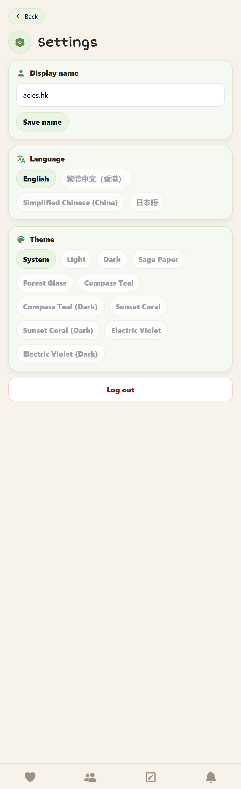
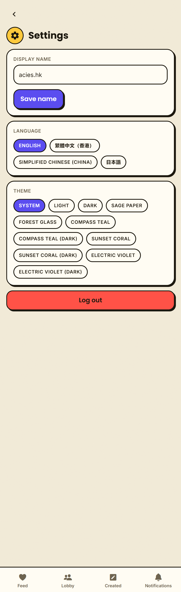
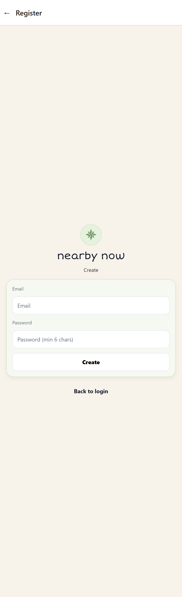
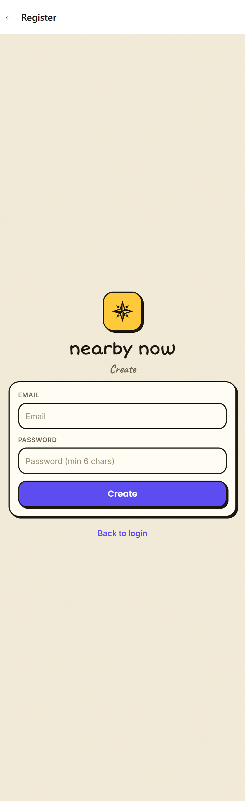

# nearby-now — Redesign Before / After

Visual before/after of the **soft-brutalism** rebrand.

- **Before** = commit `fea8433` (the app just before the design-system rebrand).
- **After** = `feature/uiux-improvements` (current).

Same screens, same seeded data — only the design language changed: from a soft, low-contrast, green-tinted **card-per-item** look **to** soft-brutalism (warm paper background, thick ink borders + hard no-blur offset shadows, bold flat accent colors, a colored category system, UPPERCASE micro-labels, brand-indigo primary actions, and a flat scannable list).

---

## 1. Login

| Before                                            | After                                            |
| ------------------------------------------------- | ------------------------------------------------ |
|  |  |

- Green-circle compass, flat borderless card → **yellow compass tile with hard offset shadow**, thick ink borders.
- Plain "Sign In" → **Caveat script** subtitle.
- White thin-border button → **brand-indigo button** with matching hard shadow.
- Plain labels → **UPPERCASE** field labels.

---

## 2. Feed / Homepage — _the biggest change_

| Before                                           | After                                           |
| ------------------------------------------------ | ----------------------------------------------- |
|  |  |

- **Individual green-tinted cards** (busy) → **flat list** with hairline dividers.
- Monochrome **green** icons → **colored category tiles** (coral / sky / mint / yellow…).
- Title + location crammed on one row (both truncate) → wordmark + short **"Pomona"** + search on one clean row.
- No view switcher / no filtering → **List/Map toggle + tag filter bar** on one row.
- No badges → **colored category badges** per row.
- `At Pomona · closes in 29 days · 2.6km away` (redundant place) → `2.6km away · closes in 29 days` (crucial info only).

---

## 3. Create

| Before                                             | After                                             |
| -------------------------------------------------- | ------------------------------------------------- |
|  |  |

- Flat white sections, no depth → **bordered cards + hard shadows**.
- Plain white pill chips → **bordered chips** (TONIGHT / LATER TODAY…) with shadow.
- White thin-border "Post now" → **brand-indigo "Post now"** with shadow.
- _Known follow-up:_ section + input labels currently duplicate (e.g. "PLACE" / "TIME" render twice).

---

## 4. Settings

| Before                                               | After                                               |
| ---------------------------------------------------- | --------------------------------------------------- |
|  |  |

- Green flat cards, green active chips → **bordered cards**, **brand-indigo** active chips (ENGLISH / SYSTEM).
- "Log out" white w/ red text → **full coral "Log out"** button with hard shadow.
- Icon-only tab bar → tab bar **with labels** (Feed / Lobby / Created / Notifications).

---

## 5. Register

| Before                                               | After                                               |
| ---------------------------------------------------- | --------------------------------------------------- |
|  |  |

Mirrors the Login treatment (compass tile, hard shadows, brand button, UPPERCASE labels).

---

_Design system: `src/ui/theme/uikit.ts` (tokens) + `src/ui/components/brutal.tsx` (components), documented live at `/uidocs`. See also [`M3_EXPRESSIVE_RESEARCH.md`](./M3_EXPRESSIVE_RESEARCH.md) and [`M3_ADOPTION_GUIDE.md`](./M3_ADOPTION_GUIDE.md)._
