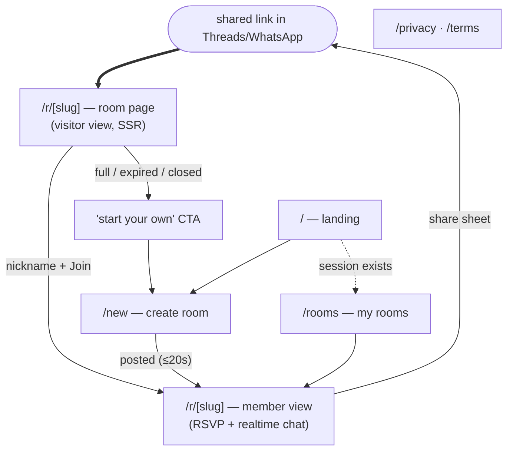

# enoki Web — Funnel-First Web App Plan 🍄🔗

**Status: DRAFT for review — no code until this is agreed.**
Branch: `feature/web-pwa`. Companion to [VISION.md](./VISION.md) §5, [COLD_START.md](./COLD_START.md) §0/§1.5.

**Naming:** the product — and the mobile app — is **enoki** (VISION §8);
`nearby-now` is only the historical repo name. Docs, issues, and all UI copy
say enoki.

> One sentence: a small, fast, purpose-built web app whose only job is to make the
> **share-link funnel** work — organizer creates a room in ≤20s, drops the link in
> their existing Threads/WhatsApp post, and a stranger is **in the room** in one
> tap with zero signup.

---

## 1. Goal, success bars, non-goals

**Goal.** Ship the funnel that COLD_START calls "the lifeline of the entire
strategy": create → share → join → chat, on the mobile web browser inside
Threads/Instagram/WhatsApp.

**Hard success bars (from COLD_START §1.5):**

| Bar                            | Measure                                                                                                 |
| ------------------------------ | ------------------------------------------------------------------------------------------------------- |
| Organizer: room + link in hand | **≤ 20 seconds**, cold browser, ≤ 2 required inputs                                                     |
| Joiner: link → in the room     | **1 tap + nickname**, zero registration                                                                 |
| Link unfurl                    | Rich preview (title · time · spots · vibe) in WhatsApp/Threads/Telegram                                 |
| First paint of `/r/[slug]`     | Fast on a mid-range phone over cellular, inside an in-app browser (SSR, minimal JS on the visitor view) |

**Non-goals for v1 (explicitly parked):**

- ❌ Feature parity with mobile — no browse/discovery feed, no map, no settings screen.
- ❌ **PWA mechanics** (manifest, install prompt, web push) — _lower priority by
  decision_. The architecture must not block it (see §11 M5), but nothing in
  M0–M4 depends on it. "No install needed" is achieved by being a good website.
- ❌ Replacing the native app. Web is the top of the funnel; the app is what a
  happy joiner graduates to (VISION §5).
- ❌ 1:1 DMs — never, on any platform (VISION §4.3).

---

## 2. Information architecture — web ≠ mobile

The mobile app is a **logged-in tab loop** (Feed / Rooms / Notifications) built
around discovery. The web app is a **funnel** — almost everyone arrives on a
_room page_ via a shared link, not on a home page. So the IA is inverted:

- **`/r/[slug]` is the real front door.** The landing page `/` exists for
  organizers and the curious, not for the funnel's main flow.
- The viral loop is built in: every dead-end state (full / expired / closed / 404) converts into "start your own" → `/new`.
- Top bar everywhere: wordmark (→ `/`), "My rooms" (only when a session
  exists), language toggle. No tab bar, no bottom nav.

---

## 3. Page-by-page specs

Every page below is specified before any code (per our working agreement).
Layout language for all pages: **560px max-width centered column** on the paper
background (matches mobile `layout.maxContentWidth`); paper margins fill wide
screens; mobile-first.

### 3.1 `/r/[slug]` — Room page (THE page)

**Purpose.** One URL, two faces: a public pitch for visitors, the working room
for members. This page carries the entire funnel; everything else is support.

**Rendering.** SSR. Server fetches via the anon-callable `get_room_public` RPC
(§6.2) so a logged-out visitor gets a fully rendered page with OG tags. The
member view hydrates client-side (session check → membership check).

**Public data policy (proposed — open question §12.2):** title, vibe,
`start_time`, `place_name` (NOT `place_address`, NOT lat/lng), capacity +
joined count, host display name, status. Member nicknames and chat are **never**
in the public payload — visitors see a count and mushroom avatars only.

**Visitor view (no session or not a member):**

- Brutal card: vibe chip (vibe color), title (display type), time ·
  place_name · "3 / 6 going" with a cluster of anonymous mushroom avatars 🍄,
  "started by {host}" line.
- **Join module** (the point of the page): nickname input (+ optional gender
  select) + one big `Join` button. On submit: create anonymous session → upsert
  profile → `join_room` RPC (§6.3) → flip to member view in place, no redirect.
- Below the fold: one-line "what is enoki" + how-it-works (three steps), so the
  link is self-explanatory to a stranger. Nothing else.

**State variants (each fully designed, each with a CTA):**

| State          | Detection                            | Copy direction                  | CTA            |
| -------------- | ------------------------------------ | ------------------------------- | -------------- |
| Open           | status=open, not expired, spots left | join module                     | Join           |
| Full           | joined_count ≥ capacity              | "This one's full 🍄"            | Start your own |
| Expired        | `expires_at < now`                   | "This hangout already happened" | Start your own |
| Closed         | status=closed                        | same as expired                 | Start your own |
| Not found      | no row for slug                      | friendly 404                    | Start your own |
| Join race lost | `join_room` returns `full`           | inline error on the join module | Start your own |

**Member view (session + joined membership):**

- Header: title + facts row + **share bar** (copy link, native `navigator.share`
  when available) — sharing stays one tap away for the organizer.
- RSVP list: nicknames, host crown 👑 (mirrors mobile's Rooms-tab crown).
- **Chat**: room_events list (existing pagination RPC), realtime via the
  existing `room_events` publication, composer with send. Quick-chips can wait
  (v1.5).
- Leave (confirm) → visitor view. Host only: Close room (confirm).
- Left/closed members get the read-only view the RLS already grants (events up
  to `left_at`).

**SEO/OG.** `<title>` = room title; description = time · place · spots; OG
image from `/api/og/[slug]` (§3.6). `noindex` on room pages (they're
link-shared, not search content — and it limits scraping).

**Acceptance.** Link tap → readable card < 1.5s on 4G mid-phone; join ≤ 1 input;
unfurl shows title/time/spots in WhatsApp + Threads; all six states reachable
and designed.

### 3.2 `/new` — Create a room

**Purpose.** The ≤20s organizer flow. One screen, one submit — a compressed web
cousin of mobile `/compose`, not the full `/create` form.

**Form (top to bottom):**

1. **Title** (required) — placeholder cycles through real examples ("今晚火鍋，仲差2個" / "board games at mine, 7pm") per VISION §9's carousel idea.
2. **Vibe chips** — single-select row, default **Open** 🧭, vibe colors from the token sheet.
3. **"More details" accordion (collapsed by default)** — time quick-picks
   (tonight / tomorrow / weekend / pick), place text, capacity stepper,
   gender pref. All optional; the accordion keeps the default path at 2 fields.
4. **"posting as \_\_\_"** — nickname input, only when no session/profile exists.
5. **Post** → anonymous session (if needed) → profile upsert → insert activity
   (slug auto-generated by DB, §6.1) → host membership → redirect
   `/r/[slug]?just_created=1` with the **share sheet already open** (copy link
   is the very next tap — the whole point).

**Acceptance.** Stopwatch test: cold browser → link copied ≤ 20s typing only
title + nickname. Errors (rate-limit, offline) leave the form intact.

### 3.3 `/` — Landing

**Purpose.** Explain enoki in one breath; route organizers to `/new`. It is NOT
a feed and NOT the funnel entrance — keep it tiny and static.

Wordmark (Madimi One) + mascot, one-liner ("揪人一齊玩，唔使做主辦人" / "get
people together — without being The Host"), primary CTA **Start a hangout** →
`/new`, three-step how-it-works (post it → drop the link → they tap in), footer
(privacy · terms · language). If a session with rooms exists → "My rooms" card.
Indexable (the only page that should be).

### 3.4 `/rooms` — My rooms

**Purpose.** Re-entry for a returning organizer/joiner (session-gated; link in
top bar only when a session exists). List of created + joined rooms (reuses the
membership query shape from mobile), each a compact brutal card → `/r/[slug]`,
host crown where applicable. Empty state → "start one" → `/new`. No tabs, no
active/inactive segmentation in v1 — newest first, closed rooms dimmed.

### 3.5 `/privacy` · `/terms` — static

Required before real strangers touch it (and before beta). Static pages,
footer-linked. Content: what we store (nickname, activity content, anonymous
account), moderation/report contact. Draft copy is an open item — not a code
blocker, is a launch blocker.

### 3.6 `/api/og/[slug]` — OG image endpoint

Generated per-room card in the brutal style: paper bg `#F3EBD8`, 2px ink border

- hard offset shadow, title in Poppins Bold, vibe chip in its color, "3/6
  going · Fri 8pm". Falls back to a generic enoki card when the room is
  closed/expired. (Next.js `ImageResponse`; fonts loaded as TTF at the edge.)

### 3.7 Global surfaces (not routes)

- **Top bar** — wordmark, My rooms (conditional), language toggle. 2px ink
  bottom border (mirrors `BAppBar`).
- **Share sheet** — modal on room page: big copy-link row, `navigator.share`
  button, QR (v1.5). Auto-opens on `?just_created=1`.
- **Confirm dialogs** — leave/close; native `window.confirm` is fine for v1
  behind a small wrapper (mobile learned RN `Alert` is unreliable on web — we
  use real DOM dialogs, problem doesn't exist here).
- **Toasts** — copy confirmations, errors. One implementation, brutal-styled.

### 3.8 `/design` — living design gallery (built FIRST, before any real page)

**Purpose.** The web twin of mobile's `/uidocs`, and the project's review
instrument: every visual decision is looked at and signed off **here** before
it's implemented anywhere real. While building, this page is how we check what
the UI looks and feels like — on a real phone, in a real in-app browser —
without touching data or routing.

**Sections (top to bottom):**

1. **Tokens** — color swatches (both palettes side by side), the paper texture
   at 3 opacities, radii, spacing scale, the three hard shadows, border
   weights.
2. **Typography** — full type scale in both fonts, the Madimi One wordmark,
   Caveat accent samples, zh-Hant + en sample strings (CJK line-height issues
   surface here, not in production).
3. **Components** — every kit piece from §7.5 in every tone and state
   (default / hover / pressed / disabled / error), fully interactive so the
   press-into-paper feel is judged by finger, not by screenshot.
4. **Motion** — press feedback, list-entrance stagger, dialog/sheet
   transitions, a `prefers-reduced-motion` simulation toggle.
5. **Page mockups** — static, fake-data renders of **every v1 page and
   state** from §3: room visitor view (open / full / expired / closed / 404),
   member room with a seeded chat, `/new` form (collapsed + expanded), share
   sheet, landing, rooms list, OG-image preview. Built purely from the kit +
   hardcoded fixtures — no Supabase, no routing logic.
6. **Controls bar (sticky)** — light/dark toggle, zh/en toggle, viewport-width
   presets (360 / 390 / 560 / desktop).

**Working agreement (the point of the page):** a funnel page may only be
implemented after its mockup on `/design` is approved. Implementation then
becomes "wire the approved mockup to real data" — layout debates happen here,
cheaply, not in PR review.

**Ships in prod?** Yes, `noindex` (same posture as mobile shipping `/uidocs`).
Zero data access, so no exposure risk; keeping it deployed means design review
happens on the deployed artifact — real fonts, real texture perf, real phone.

**Parked routes (designed later, not now):** `/browse` (web discovery),
`/settings`, account-upgrade page, install/PWA surfaces.

---

## 4. Identity — guest-first, zero-signup

**Mechanism: Supabase anonymous sign-ins** (a first-class Supabase feature).
Key property discovered in the RLS audit (§6): anonymous users get the
**`authenticated` role** — so every existing policy (join open rooms, chat as
member, upsert own profile) works for guests **with zero policy changes**. The
mobile app is untouched.

- Guest = anonymous auth user + `profiles.display_name` = nickname. Session
  persists in the browser (localStorage) — a returning joiner keeps their
  identity and rooms.
- **Organizer durability risk:** clearing site data = losing host access. v1
  accepts this (documented in the room's share sheet copy: "this link is your
  room — keep it"); v1.5 adds the optional "add an email to keep your rooms"
  nudge (Supabase `linkIdentity`/`updateUser` upgrades an anonymous user in
  place, same uid — no data migration).
- **Abuse posture:** Supabase's built-in per-IP anonymous sign-in rate limits
  on day 1; Turnstile CAPTCHA on `/new` and join if pressure appears; the
  VISION §7 phone-verification gate for high-risk actions is the designed
  escalation path (out of v1 scope, nothing here blocks it).
- Sign-out / "not you?" link lives next to the nickname wherever it's shown.

---

## 5. What web reuses from the repo (and what it doesn't)

The mobile layering pays off, but not by importing `lib/backend` wholesale —
that file pulls RN-only deps (AsyncStorage, RN URL polyfill). The reuse split:

| Layer                 | Web strategy                                                                                                                                                                                                                                                                                                    |
| --------------------- | --------------------------------------------------------------------------------------------------------------------------------------------------------------------------------------------------------------------------------------------------------------------------------------------------------------- |
| **Supabase client**   | New: browser + server clients via `@supabase/ssr` (cookie-based session so SSR can see auth)                                                                                                                                                                                                                    |
| **Backend adapter**   | New thin `web/src/lib/backend.ts` implementing the _same function names_ as `supabase_backend.ts` for the subset web needs (join, members, room events page RPC, insert event, create activity, profile upsert) — same seam, second implementation, exactly the swap the architecture doc planned for           |
| **Pure domain logic** | Shared: vibe taxonomy, joinability/expiry predicates, types. Start as direct imports from `lib/domain`; if Next's outside-root imports fight us, mirror into `web/src/domain` with a "source of truth: /lib/domain" header (extraction into a real `packages/domain` is a later refactor, not a v1 requirement) |
| **UI**                | Not reused. RN components stay native; web gets its own small kit (§7) built from the same tokens                                                                                                                                                                                                               |
| **i18n strings**      | Reuse keys/tone from `locales/` where the concept matches                                                                                                                                                                                                                                                       |

---

## 6. Backend work items (migrations — the only "code" before UI exists)

The RLS audit found policies are all `TO authenticated` with reads wide open to
any authed user, writes properly owner-scoped. Three real gaps for web:

1. **`share_slug` on activities.** Short, unambiguous link ids (10-char
   lowercase base32, no `0/o/1/l`), `UNIQUE`, generated by a `BEFORE INSERT`
   trigger with collision retry — so rooms created from **mobile** get slugs
   too and one link format serves both. Backfill existing rows.
2. **`get_room_public(p_slug)` RPC** — `SECURITY DEFINER`, `GRANT EXECUTE TO
anon, authenticated`. Returns exactly the §3.1 public field whitelist +
   `joined_count` + host display name. This is the _only_ anonymous read
   surface; base-table grants for `anon` stay at zero.
3. **`join_room(p_activity_id)` RPC** — atomic join with capacity check
   (row-lock the activity, count members, insert-or-reactivate membership).
   Today capacity is **not enforced anywhere server-side** — the RLS
   `members_insert_self_open_only` checks open+unexpired but not capacity, so
   two simultaneous joins can overfill a room. This RPC fixes it for web and
   is adoptable by mobile later (flagged for the mobile backlog).
4. **Enable anonymous sign-ins** — `supabase/config.toml` for local, dashboard
   for prod.
5. _(M4)_ **`funnel_events` table** — insert-only (anon+authenticated), no
   select policy; columns: event, slug, referrer-ish context, created_at. Feeds
   the COLD_START §3 metrics via plain SQL.

Realtime needs nothing: `room_events` is already in the publication
(`20260714000000_realtime_publication.sql`) and RLS-filtered subscriptions work
for anonymous-auth users as members.

---

## 7. Design-system port — soft neo-brutalism on paper, in CSS

Source of truth extracted from [`src/ui/theme/uikit.ts`](../src/ui/theme/uikit.ts)
(and it stays the source of truth — web mirrors it, doesn't fork the values).
Deliverable: `tokens.css` (custom properties, light + dark via
`prefers-color-scheme`) + a component kit ≈ 10 pieces, all rendered and
reviewed on the `/design` gallery (§3.8) before any funnel page uses them.

### 7.1 Tokens (extracted values)

| Token                                      | Light                                             | Dark                                              |
| ------------------------------------------ | ------------------------------------------------- | ------------------------------------------------- |
| bg (paper)                                 | `#F3EBD8`                                         | `#1B1710`                                         |
| surface (card paper)                       | `#FFFCF3`                                         | `#26211A`                                         |
| ink / border                               | `#1C180F`                                         | ink `#F3EBD8`, border `#8A7C5E` (muted, no glare) |
| text / subtext                             | `#241F14` / `#6E6450`                             | `#EFE7D4` / `#B0A68C`                             |
| brand / onBrand                            | `#5B4DF0` / white                                 | `#8E80FF` / `#141019`                             |
| accents (yellow·coral·mint·sky·pink·grape) | `#FFC93C #FF6B4A #2FCE8E #54C1FF #FF7AC6 #B57BFF` | lightened variants (see uikit.ts)                 |
| onBright                                   | `#1C180F`                                         | `#141019`                                         |
| success / warn / danger                    | `#12A66C / #F5A300 / #FF5247`                     | `#2FCF8E / #FFC44D / #FF6A61`                     |
| shadow                                     | `#1C180F`                                         | `#000000`                                         |

- **Radii:** 12 / 16 / 20 / 26 / pill. **Borders:** 1 / 1.5 / 2px.
- **Hard shadow (the signature):** no blur — `box-shadow: 3px 3px 0 var(--shadow)` (sm 2, md 3, lg 5).
- **Press behavior:** control translates by its shadow offset and the shadow
  collapses to 0 (`pressShift`) — pressing _into_ the paper, same as `BButton`.
- **Spacing:** 4/8/12/16/20/24/32. **Content cap:** 560px centered.

### 7.2 Paper texture

Mobile's `PaperTexture` is SVG `feTurbulence` fractalNoise grain + a faint
graph-paper grid tinted to the brand hue at ~0.06 opacity — that filter is
_native_ web SVG, so it ports 1:1 as a fixed full-viewport background layer.
Zero images, zero requests. (Perf note: one static SVG layer, `pointer-events:
none`; if in-app browsers show jank we pre-rasterize to a tiled PNG — decided
by measurement in M0, not by taste.)

### 7.3 Type

Poppins 700/600 (display/headings) · Inter 400/600 (body) · Caveat 700 (accent,
sparingly) · **Madimi One (wordmark only)** — all via `next/font` (self-hosted,
no FOUT). Labels UPPERCASE + 0.5 tracking. Scale: display 30/36 · h1 24/30 ·
h2 19/25 · title 16/22 · body 15/22 · label 12/16 · caption 12/16.

### 7.4 Motion & accessibility floors

M3 direction (per [M3_ADOPTION_GUIDE.md](./M3_ADOPTION_GUIDE.md)) — crisp, not
bouncy: durations 150/260/420ms; emphasized-decelerate
`cubic-bezier(.05,.7,.1,1)` for entrances, emphasized-accelerate
`cubic-bezier(.3,0,.8,.15)` for exits, standard `cubic-bezier(.2,0,0,1)`
otherwise; 45ms list stagger; CSS transitions first, no animation library until
a concrete need. `prefers-reduced-motion` → fades only (A3). Hard floors from
the M3 guide apply verbatim: 4.5:1 body text (`faint` banned for body), ≥48px
touch targets, action-named `aria-label`s on icon buttons.

### 7.5 Component kit (mapped from brutal.tsx)

| Web component                              | Mobile source             | Used on                   |
| ------------------------------------------ | ------------------------- | ------------------------- |
| `Button` (primary/secondary/accent/danger) | BButton                   | everywhere                |
| `Card`                                     | BCard                     | room, rooms list, landing |
| `Chip` (+ vibe colors, pressable)          | BChip                     | vibe rows, filters        |
| `Input` / `Stepper`                        | BInput / BStepper         | join, create              |
| `TopBar`                                   | BAppBar                   | global                    |
| `Badge`                                    | BBadge                    | spots left, host crown    |
| `Accordion`                                | BAccordion                | create "more details"     |
| `RoomCard`                                 | BActivityRow              | rooms list                |
| `Avatar` (mushroom 🍄)                     | — (new, VISION §8 mascot) | RSVP list, visitor count  |
| `Toast` / `Dialog` / `ShareSheet`          | — (web-native)            | global                    |

---

## 8. Stack & repo shape

- **Framework: Next.js (App Router, TypeScript) on Vercel.** Chosen for: SSR +
  per-route metadata (the OG unfurl is half the strategy), `ImageResponse` for
  §3.6, `@supabase/ssr` first-class, React (mental-model reuse from the RN
  codebase), free tier. Considered: Astro (islands model awkward for the
  realtime member room), SvelteKit (no React reuse), Remix (fine, but OG
  imaging + hosting are more turnkey on Next/Vercel). This is a
  recommendation, not a religion — veto point is §12.
- **How we use Next: base React with a server-rendered front door.** Next
  earns its place for exactly one surface — the public room view — so its
  APIs are confined there. **Rule: Next-specific imports (`next/*`, server
  components, route handlers) are allowed only in the "front door" files:**
  the `/r/[slug]` server component + its `generateMetadata`, the `/api/og`
  route, and root layout/font plumbing. Everything else — component kit,
  `/design`, member room, `/new`, `/rooms`, landing — is portable client
  React, written exactly as it would be in a Vite SPA (no Next imports).
  This quarantines Next's failure modes (fetch caching, hydration,
  server/client boundary) into a handful of files, and keeps an exit hatch:
  the client code lifts into a plain SPA unchanged if we ever drop Next.
  Two corollaries: room pages opt out of Next caching (`force-dynamic` — a
  live room must never render stale), and timestamps are formatted
  client-side only (viewer's timezone; also avoids the classic SSR hydration
  mismatch).
- **Repo: `web/` folder in this repo**, own `package.json` + lockfile, **not**
  npm workspaces (the root package _is_ the Expo app; hoisting under Metro is
  risk with zero v1 payoff). Shared-code strategy per §5. CI treats `web/` as
  its own build.
- **Env:** same Supabase project; `NEXT_PUBLIC_SUPABASE_URL` / `_ANON_KEY`
  mirroring the Expo vars. Service-role key only if the RPC route proves
  insufficient (design goal: it doesn't — RPCs keep one security model).

## 9. i18n

Traditional Chinese + English from day 1 (`next-intl`; keys/tone carried from
`locales/` where concepts match) — the wedge is Chinese-market Threads
(VISION §5), so zh copy is not a "localization pass", it's the primary voice.
Locale by `Accept-Language` with a top-bar toggle persisted per browser.
Default for ambiguous visitors: **zh-Hant** (open question §12.3).

## 10. Instrumentation — COLD_START §3 made measurable

`funnel_events` rows (no third-party analytics in v1; owned + queryable):

| Event                          | Fired                                                                               |
| ------------------------------ | ----------------------------------------------------------------------------------- |
| `link_open`                    | room page visitor view rendered (+ referrer bucket: threads/ig/whatsapp/direct)     |
| `join_start` / `join_done`     | join module focus / membership created                                              |
| `message_sent`                 | first message per member per room (the "activation" signal)                         |
| `create_start` / `create_done` | `/new` mount / activity created (elapsed ms → the 20s bar is _measured_, not vibes) |
| `share_copied`                 | share sheet copy/share tap                                                          |

Headline metrics = COLD_START's own: link→join conversion, create→first-join
success rate, % organic (non-seed) creates. Plain SQL, no dashboard tooling yet.

## 11. Phasing (each milestone independently reviewable)

| M                 | Scope                                                                                                      | Acceptance                                                                                                                                                                                  |
| ----------------- | ---------------------------------------------------------------------------------------------------------- | ------------------------------------------------------------------------------------------------------------------------------------------------------------------------------------------- |
| **M0a**           | `web/` scaffold, tokens.css, texture, fonts, component kit, `/design` §1–4 (tokens/type/components/motion) | side-by-side with mobile `/uidocs`: same paper, same shadows, same press feel; texture perf measured in an in-app browser                                                                   |
| **M0b**           | `/design` §5: fake-data mockups of **every v1 page + state**                                               | **the design gate** — each page mockup explicitly approved on a phone before its implementation milestone may start; iteration happens here                                                 |
| **M1**            | Migrations §6.1–6.4 · `/r/[slug]` visitor view SSR · all 6 states · OG endpoint · 404                      | matches its approved mockup; link unfurls correctly in WhatsApp/Threads/Telegram; every state screenshot-reviewed; anon reads limited to the RPC whitelist (verified with anon key by hand) |
| **M2**            | Join flow (anon session) · member view · realtime chat · leave/close                                       | matches mockup; two browsers chat live; capacity race provably closed (parallel join test); left-member read-only works                                                                     |
| **M3**            | `/new` + share sheet · `/` landing · `/rooms`                                                              | matches mockups; stopwatch: cold browser → link copied ≤ 20s; share sheet auto-opens post-create                                                                                            |
| **M4**            | i18n complete · funnel_events · privacy/terms · perf pass · prod domain                                    | zh+en review; events visible in SQL; Lighthouse mobile ≥ 90 on `/r/[slug]` visitor view                                                                                                     |
| **M5** _(parked)_ | PWA manifest + install prompt · account-upgrade nudge · QR · quick-chips · web push _(much later)_         | —                                                                                                                                                                                           |

Nothing in M0–M4 requires M5 decisions; the PWA layer is purely additive
(manifest + service worker over the same app).

### Style checkpoints — how we verify we're on track (local-first)

We build and review **locally**; no deployment until M4 (Vercel stays the
target host, deferred). Each checkpoint: `cd web && npm run dev`, open
`http://localhost:3000/design` on desktop and `http://<LAN-IP>:3000/design`
on a phone on the same Wi-Fi.

| Checkpoint                | After               | What you judge                                                                                                                                        |
| ------------------------- | ------------------- | ----------------------------------------------------------------------------------------------------------------------------------------------------- |
| **CP1**                   | M0a (issues 1–4)    | tokens, paper texture, type, every component interactive on `/design` — does it feel like enoki's paper? Side-by-side with the mobile app's `/uidocs` |
| **CP2 — the design gate** | M0b (issues 5–8)    | every page mockup with fake data; each page needs explicit approval before its implementation issue starts                                            |
| **CP3–5**                 | end of M1 / M2 / M3 | real pages checked against their approved mockups ("matches mockup" is in each milestone's acceptance)                                                |

In-app-browser checks (Threads/IG webview) need a public URL — if needed
before M4, use a temporary tunnel (e.g. `cloudflared`) rather than deploying
early.

## 12. Open questions (need Nicole/CY — everything else above is proposed-final)

1. **Domain + link shape.** VISION §8 says EnokiApp.com is available/cheap. Is
   the link `enokiapp.com/r/abc123`? (Shorter domain = better in a Threads
   post; this is a GTM decision, not technical.)
2. **Public-exposure policy sign-off (§3.1).** An unauthenticated page will
   show: title, time, `place_name`, host nickname, vibe, spots. Excluded:
   address, coordinates, member names, chat. Confirm this line — it's a
   privacy/product call, and today _nothing_ is visible without login.
3. **Default language** for visitors we can't detect: zh-Hant (proposed) or en?
4. **Guest-organizer risk acceptance (§4).** OK for v1 that a host who clears
   browser data loses host controls (upgrade nudge lands v1.5)?
5. **Visitor-view chat teaser.** Show "💬 12 messages" (activity signal, FOMO)
   or nothing about chat at all? Proposed: show count only.
6. **Dark mode** auto-only (`prefers-color-scheme`, no toggle) for v1 —
   acceptable?
7. **Framework/hosting veto (§8)** — any objection to Next.js + Vercel + a
   `web/` folder in this repo?

---

_Next step after review: fold in answers, then M0 starts with `/design` —
the first thing built is the thing we judge everything else against, and no
funnel page is implemented before its mockup is approved there._
